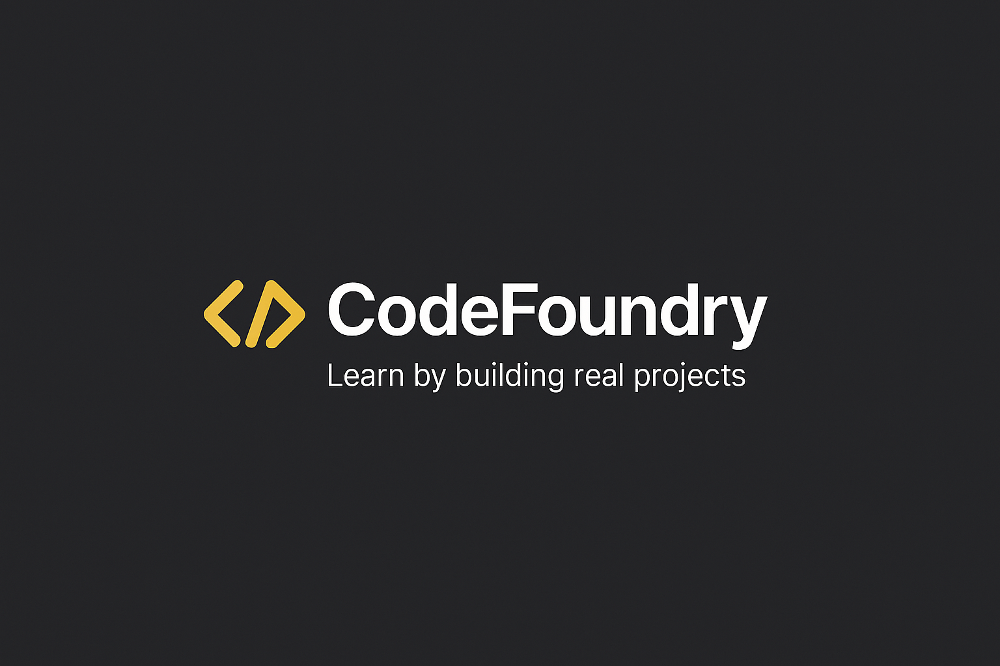

  

CodeFoundry es una plataforma educativa orientada a desarrolladores que buscan aprender
programación y desarrollo de sistemas a través de proyectos reales.

El foco del producto es:

- Aprender a levantar requerimientos
- Tomar decisiones técnicas informadas
- Diseñar soluciones reales
- Implementar, refactorizar y mejorar sistemas
- Usar IA como acompañante técnico (mentor) y no como reemplazo

### Filosofía

- Menos teoría aislada, más práctica contextual
- No existe una única solución correcta
- La experiencia simula trabajo real en equipos de desarrollo

### Público objetivo

- Estudiantes de programación
- Developers junior / semi-senior
- Personas que quieren practicar escenarios reales

 

# Funcionalidades core (MVP)

### 👤 Autenticación

- Login
- Registro
- Logout
- Sesión persistente

### 📚 Cursos

- Listado de cursos
- Página de detalle de curso
- Cada curso tiene:
  - Título
  - Descripción
  - Dificultad
  - Categoría
  - Lista de videos

### 🎥 Videos

- Embed (YouTube / Vimeo)
- Marcar como “visto”
- Progreso del curso (opcional)

### ⭐ UX importante

- Estado vacío (sin cursos)
- Curso bloqueado / desbloqueado (fake)
- Loading states
- Error states

### MVP (ideal para terminarlo)

- ✔ Login
- ✔ Lista de cursos
- ✔ Detalle con videos
- ✔ Progreso simple
- ✔ Un Design System

 

# Roadmap sugerido (muy práctico)

### Fase 1 – Base técnica

- Setup Next.js
- Auth
- DB
- Seed de cursos

### Fase 2 – Producto

- UI base con 1 Design System
- Flujo completo
- Estados

### Fase 3 – IA intensiva

- Refactor con IA
- Review automático
- Copy UX

### Fase 4 – Comparativa

- Reimplementar UI con otro Design System
- Documentar diferencias
