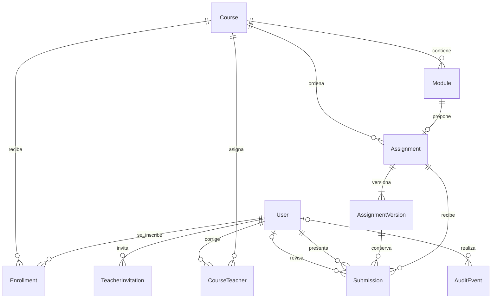

# Evaluación manual y administración

La Fase 4 implementa los roles, las entregas versionadas y la revisión manual del
MVP acordado en [mvp-scope.md](mvp-scope.md). Las lecciones completas y los recursos
se desarrollan en la Fase 5; los certificados, en la Fase 6.

## Modelo



Un usuario puede tener varios roles: alumno, profesor y administrador. El registro
público crea únicamente alumnos activos. Enrollment conserva la inscripción;
Progress sigue siendo avance de lectura y no acredita aprobación.

CourseTeacher vincula profesores con cursos. Assignment identifica cada entrega,
su módulo, orden y obligatoriedad. AssignmentVersion conserva la consigna y los
criterios de aceptación como JSON validado: identificador, descripción, resultado
esperado y obligatoriedad. Submission guarda alumno, número de intento, versión
exacta, repositorio, commit completo, instrucciones, evidencias, explicación y
corrección por criterio. Su clave foránea compuesta impide vincular la versión
de otra entrega.

TeacherInvitation conserva email, hash del token, vencimiento, emisor y fecha de
uso. AuditEvent registra actor, acción, destinatario, fecha y detalles de cambios.
El panel de administración muestra las últimas acciones con sus destinatarios.

## Permisos y flujo

| Rol | Acceso y acciones |
| --- | --- |
| Alumno | Ver sus consignas e historial en cursos publicados donde está inscrito; enviar y reenviar su trabajo. |
| Profesor | Ver y corregir trabajos de sus cursos asignados; tomar o liberar una revisión. No puede corregir su propio trabajo. |
| Administrador | Buscar cuentas, asignar roles, activar/desactivar, invitar profesores, asignar cursos y consultar pendientes y auditoría. Corregir requiere además rol profesor y asignación. |

Las páginas y Server Actions consultan los permisos actuales en PostgreSQL.
La sesión no es una copia persistida de los roles. Desactivar una cuenta impide
usar sesiones anteriores; quitar un rol retira inmediatamente las acciones de ese
rol. Los formularios nunca eligen la identidad del actor.

1. El alumno envía repositorio HTTPS accesible al profesor, hash completo del
   commit de 40 caracteres y explicación con instrucciones y evidencias.
2. La entrega pasa a **Enviada**. Solo un profesor asignado puede tomarla; pasa a
   **En revisión** y queda reservada para ese profesor.
3. El profesor evalúa todos los criterios de la versión presentada. Cada criterio
   incumplido exige una devolución. Todos los obligatorios cumplidos producen
   **Aprobada**; de lo contrario, **Cambios solicitados**.
4. Con cambios solicitados se habilita otro intento con un commit diferente.
   No se modifica el intento anterior. No hay un límite de reenvíos.
5. La entrega siguiente se habilita cuando todas las anteriores obligatorias
   están aprobadas. La lectura de módulos mantiene su progreso independiente.

Las revisiones finalizadas son inmutables desde la aplicación. Retirar la
asignación de un profesor, desactivarlo o quitarle el rol libera sus revisiones
activas, conservando las finalizadas. Se protege al último administrador activo.
La interfaz del profesor muestra hasta 20 trabajos por sección y los diez intentos
anteriores de una entrega; el alumno conserva acceso a todo su historial.

Las escrituras de evaluación, roles, invitaciones y seed comparten un advisory lock
transaccional de PostgreSQL. Para esta beta serializa operaciones y evita reservas,
intentos duplicados y desactivaciones concurrentes del último administrador.
Es una decisión de simplicidad; un volumen mayor requerirá locks más específicos.
Los cambios y su auditoría se confirman en la misma transacción.

Las vistas consultan Prisma directamente, sin Data Cache. Los formularios
ejecutan la Server Action mediante un callback del cliente. La acción invalida las
rutas afectadas. Los cambios de estado de entregas y revisiones recargan la página
para mostrar el estado confirmado en PostgreSQL. Los formularios administrativos
refrescan el router y conservan sus confirmaciones y el enlace de invitación.
El envío se habilita cuando el cliente está listo y se bloquea durante la operación.

## Operación

```powershell
pnpm db:generate
pnpm db:migrate
pnpm db:seed
pnpm db:seed-assessments
pnpm admin:bootstrap --email tu-email-registrado@example.com
```

El último comando requiere una cuenta ya registrada y activa. Agrega el rol
administrador conservando los otros roles; no crea contraseñas ni publica una
ruta para elevar privilegios. Debe ejecutarlo el operador con acceso al entorno.
Después, abrir `/admin`. La migración conserva las cuentas existentes como alumnos.

Las tres entregas del curso piloto están en
[real-world-auth.json](../content/assessments/real-world-auth.json), vinculadas a los
módulos 3, 5 y 7. El seed es idempotente. Cambiar instrucciones o criterios exige
incrementar `version`; impide sobrescribir una versión o retrocederla. Los
intentos existentes mantienen su versión. El seed de cursos impide eliminar un
módulo con una entrega asociada para preservar las referencias.

El administrador genera invitaciones desde `/admin` y comparte el enlace
manualmente. Requieren `AUTH_URL` correcto, vencen a los siete días y se usan
una sola vez desde una cuenta del mismo email. Se guardan únicamente hashes;
el enlace original se muestra al crearlo. Puede revocarse o generarse otro.
Si el emisor deja de ser administrador activo, su invitación deja de ser válida.
Aceptar agrega el rol profesor; el administrador debe asignar luego sus cursos.
No se envían correos automáticamente.

## Verificación

```powershell
pnpm test
pnpm test:db
pnpm exec playwright test e2e/evaluation.spec.ts
pnpm lint
pnpm typecheck
pnpm build
```

`test:db` crea una base temporal con nombre aleatorio, aplica todas las migraciones,
ejecuta integración de acceso y evaluación y elimina esa base al finalizar,
también si fallan las pruebas. Requiere permiso PostgreSQL para crear bases.
No ejecutar directamente la integración de evaluación contra una base con
administradores reales: las pruebas del último administrador necesitan aislamiento.
Las pruebas de integración quedan omitidas en `pnpm test` por defecto.

El E2E de evaluación crea y elimina fixtures identificados por UUID; ejecutarlo
sobre una base de desarrollo o pruebas, como los demás E2E. Verifica los tres
paneles, devolución, reenvío, aprobación, invitación y retiro de permisos.
Playwright arranca la aplicación en el puerto 3100 y ajusta AUTH_URL para ese
proceso. Podés cambiarlo con E2E_PORT; no reutiliza servidores existentes salvo
que se indique E2E_REUSE_SERVER=1.
El recorrido completo de los E2E anteriores y el CI remoto se revisan en la Fase 7.
